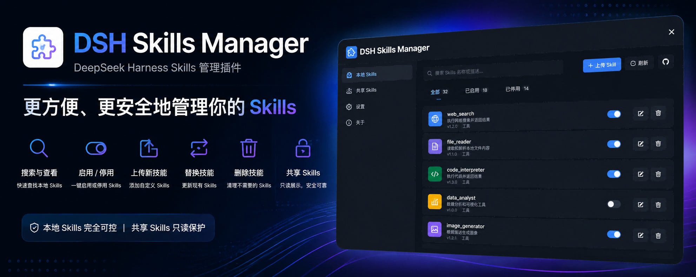
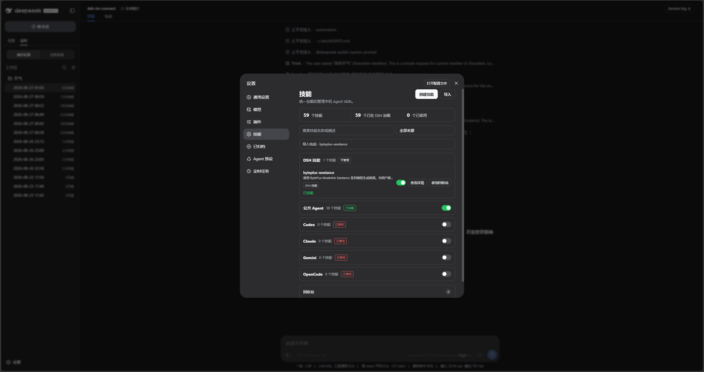
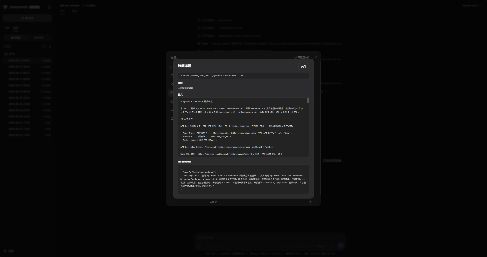
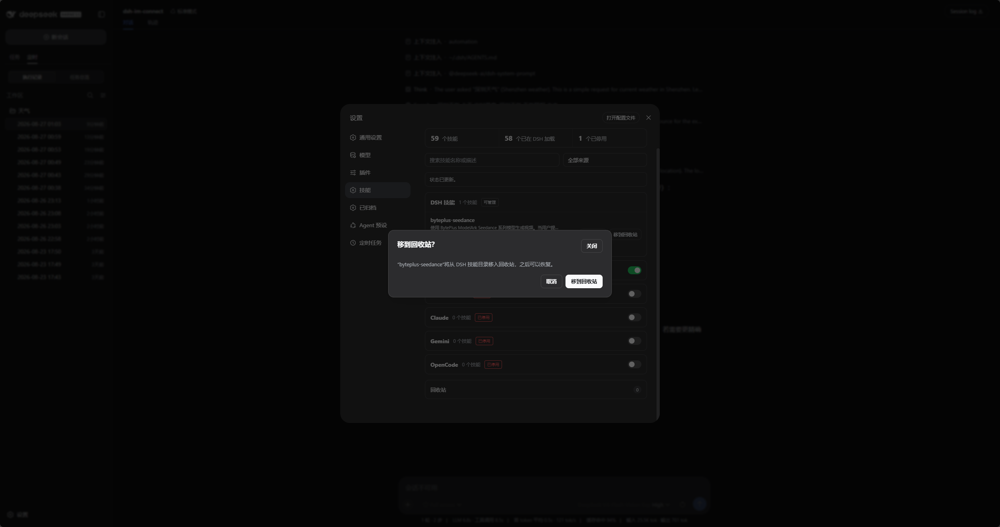

<p align="center">
  
</p>

<div align="center">

  # DSH Skills Manager

  **在 DeepSeek Harness 中统一加载并安全管理本机 Agent Skills**

  [English](README.md) · [更新日志](CHANGELOG.zh-CN.md) · [Apache-2.0](LICENSE)

  [](LICENSE)
  [](https://www.npmjs.com/package/@michengai/dsh-skills-manager)
  [](https://www.npmjs.com/package/@michengai/dsh-skills-manager)
  [](https://github.com/liushutan/dsh-skills-manager)
  [](https://nodejs.org/)
</div>

> DSH Skills Manager 是社区维护的 DeepSeek Harness（DSH）插件，并非 DeepSeek AI 官方产品。


## 功能概览

- 自动发现并把 `.agents`、Codex、Claude、Gemini 和 OpenCode 的用户级技能真正加载进 DSH。
- 外部来源启停只写入 `$DSH_HOME\skills-manager\state.json`，绝不改写共享源文件。
- 按来源折叠、搜索和筛选，并查看技能正文、frontmatter、加载状态、重名遮蔽与格式诊断。
- 在设置页或对话中创建 DSH 本地技能；对话工具在写入前请求用户确认。
- DSH 本地技能删除后先进入回收站，支持恢复和二次永久删除。
- 支持把 `.zip`、包含 `SKILL.md` 的技能文件夹或单个 `SKILL.md` 安全导入 `$DSH_HOME\skills`。

## 界面预览

在「设置 → 技能」中按来源管理 DSH 与其他本机 Agent 的技能；外部技能通过 manager provider 加载，源文件保持只读：



打开任意技能可查看来源路径、诊断结果、Markdown 正文与解析后的 frontmatter：



DSH 本地技能移入回收站前需要确认；永久删除前仍可恢复：



## DSH 产品生态

本产品既可以独立安装，也可以随桌面端或 Web 套件一起使用。它们共享同一个 DSH 核心，但面向不同的使用方式：

| 产品 | 与本产品的关系 |
| --- | --- |
| [DeepSeek Harness](https://github.com/deepseek-ai/deepseek-harness) | 本产品的运行宿主，提供模型、会话、工具和插件系统 |
| [DSH Codex Desktop](https://github.com/liushutan/dsh-codex-desktop) | 下载安装即用的桌面产品，已内置本产品和其他 5 个功能产品 |
| 6 个功能产品 | [Codex UI](https://github.com/liushutan/dsh-codex-ui) · [IM Connect](https://github.com/liushutan/dsh-im-connect) · [Automation](https://github.com/liushutan/dsh-automation) · [Skills Manager](https://github.com/liushutan/dsh-skills-manager) · [Archive Manager](https://github.com/liushutan/dsh-archive-manager) · [Agency Agents](https://github.com/liushutan/dsh-agency-agents) |

## 前置条件

- 已可正常运行 DeepSeek Harness Web，且可在 PowerShell 中使用 `dsh`。
- 以下示例使用 `web` profile；请替换为实际目标 profile。
- 从源码安装或二次开发需要 Node.js 20+；仅从 npm 安装无需在任意目录执行 `npm install`。

## 安装

`dsh plugin add` 会转发到 profile 目录里的 `pnpm add`。不写版本、不指定官方源时，本机镜像和最短发布间隔可能让你停在旧版。

### 交给其他 Agent 一句话安装

本插件运行在 DeepSeek Harness Web 里。把下面其中一句复制到 DSH、Codex 或 WorkBuddy，让它代你安装到本机 `web` profile。

从 npm 安装：

```text
请把 DSH 插件 @michengai/dsh-skills-manager 最新版装进本机 web profile，使用官方 npm 源执行：dsh plugin --profile web add @michengai/dsh-skills-manager@latest --registry=https://registry.npmjs.org/。装完执行 dsh --profile web --dump-config，确认已挂载 skills-manager，并提醒我重启 DSH Web 后硬刷新浏览器。
```

从源码安装：

```text
请从 https://github.com/liushutan/dsh-skills-manager 安装 DSH 插件：克隆仓库，执行 npm install 和 npm test，再在该目录执行 dsh plugin --profile web add .。不要只复制 lib。然后执行 dsh --profile web --dump-config，确认已挂载 skills-manager，并提醒我重启 DSH Web 后硬刷新浏览器。
```

| 产品 | 怎么用 |
| --- | --- |
| DSH | 把上面其中一句发给当前会话。 |
| Codex | 把上面其中一句发给 Codex，让它在本机执行安装。 |
| WorkBuddy | 把上面其中一句发给 WorkBuddy；源码安装也可同时粘贴仓库地址 `https://github.com/liushutan/dsh-skills-manager`。 |

Codex 和 WorkBuddy 只负责代装；装好后仍要打开 DSH Web 使用「设置 → 技能」。

也可以自己执行同一条 npm 命令：

```powershell
dsh plugin --profile web add @michengai/dsh-skills-manager@latest --registry=https://registry.npmjs.org/
```

未把 `dsh` 装进 PATH 时，把开头的 `dsh` 换成 `npx --yes @deepseek-ai/dsh`。

### 从官方 npm 安装最新版

在任意 PowerShell 目录执行：

```powershell
[Console]::OutputEncoding = [System.Text.Encoding]::UTF8
$OutputEncoding = [System.Text.Encoding]::UTF8
dsh plugin --profile web add @michengai/dsh-skills-manager@latest --registry=https://registry.npmjs.org/
dsh --profile web --dump-config
```

需要钉死某一版时，把 `@latest` 换成具体版本，例如 `@0.1.25`。

配置输出中应包含 `skills-manager`。安装后重启 DSH Web 并在浏览器硬刷新。不要手工复制客户端文件，`dsh plugin add` 会同时应用 `cordis.patch.yml`。

### 从源码安装

适用于调试或使用未发布改动。克隆后的本地路径就是插件安装路径：

```powershell
[Console]::OutputEncoding = [System.Text.Encoding]::UTF8
$OutputEncoding = [System.Text.Encoding]::UTF8
Set-Location D:\Repository\deepseek-harness-plugin
git clone https://github.com/liushutan/dsh-skills-manager.git
Set-Location .\dsh-skills-manager
npm install
npm test
dsh plugin --profile web add .
dsh --profile web --dump-config
```

完成后重启 DSH Web 并硬刷新浏览器。`dsh plugin ... add .` 会读取当前目录的包信息和 `cordis.patch.yml`；不要改为直接复制 `lib` 目录。

## 使用

打开「设置 → 技能」，再按下表操作：

| 目标 | 操作 | 范围 |
| --- | --- | --- |
| 搜索或筛选 | 按来源、名称或简介收窄列表。 | 全部来源 |
| 查看详情与诊断 | 查看正文、frontmatter、源文件路径、格式问题和重名遮蔽。 | 全部来源 |
| 启用或停用 | DSH 技能更新自身调用策略；外部技能只更新 manager 本地状态。 | 全部来源 |
| 创建或导入 | 在设置页创建，或导入 `.zip`、包含 `SKILL.md` 的文件夹、单个 `SKILL.md`。 | `$DSH_HOME\skills` |
| 从对话创建 | 让 Agent 调用 `create_skill`；写入前由 DSH 审批界面确认。 | `$DSH_HOME\skills` |
| 删除与恢复 | 删除先进入回收站；可恢复或永久二次删除。 | DSH 本地技能 |

> 共享来源的启停不会修改源文件；只有 DSH 本地技能可以移入回收站。

按 ESC 只关闭最上层上传框或确认框，设置页会保持打开。

## 权限与安全边界

| 目录 | 查看/加载 | 启用或停用 | 创建/导入 | 删除 |
| --- | --- | --- | --- | --- |
| `$DSH_HOME\skills` | 支持 | 改写本地调用策略 | 支持 | 进入回收站 |
| `$DSH_AGENTS_HOME\skills` | 支持 | 仅写 manager 状态 | 不支持 | 不支持 |
| `~/.codex/skills`、`~/.claude/skills`、`~/.gemini/skills`、`~/.config/opencode/skills` | 支持 | 仅写 manager 状态 | 不支持 | 不支持 |

- 启用、停用和删除只接受单个普通技能名称，目录穿越名称会被拒绝。
- 覆盖前先复制到同目录临时路径；复制成功前不会改动现有技能。
- 全部接口（含 GET `/state`）只接受 loopback `Host`，或 DSH Web runtime 已通过 LAN 绑定和 `--trusted-host` 明确信任的 `host[:port]`；未知 Host 继续返回 403。
- 浏览器请求还必须满足同源 `Origin` 且不能标记为 cross-site；写入接口继续要求 JSON 与 DSH 客户端请求标记。
- 导入接受用户选定的本机路径。Host 信任栅栏用于防 DNS rebinding，不是身份认证；通过反向代理或局域网提供服务时，仍应配置认证、VPN 或网络访问控制。

## 二次开发

当前仓库未提供 `src` 源目录，`lib` 是直接维护的运行源码；这是当前仓库的实现方式，不是新插件的推荐布局。新插件建议使用 `src` 开发并构建到 `lib`：

- [lib\index.js](lib/index.js)：Host 服务与本地技能文件操作入口。
- [lib\client.js](lib/client.js)：设置页、上传和确认交互。
- `test\core-test.mjs`：文件操作、权限和导入边界测试。
- `test\locale-test.mjs`：界面词条测试。

修改后运行测试、检查发布内容并以本地目录安装验证：

```powershell
[Console]::OutputEncoding = [System.Text.Encoding]::UTF8
$OutputEncoding = [System.Text.Encoding]::UTF8
npm test
npm run pack:check
dsh plugin --profile web add .
```

修改文件写入逻辑时必须保留路径校验、临时目录复制和公共技能只读限制。

## 验证

```powershell
[Console]::OutputEncoding = [System.Text.Encoding]::UTF8
$OutputEncoding = [System.Text.Encoding]::UTF8
npm test
npm run pack:check
```

`prepublishOnly` 会在发布前自动执行核心测试。

## 项目文档与许可证

项目状态、使用边界、技术架构和迭代记录从[文档交接入口](docs/00-交接入口/00-阅读导航.md)开始。详细操作说明见 `docs\02-产品与业务\01-使用说明.md`。

本项目采用 [Apache License 2.0](LICENSE)。
